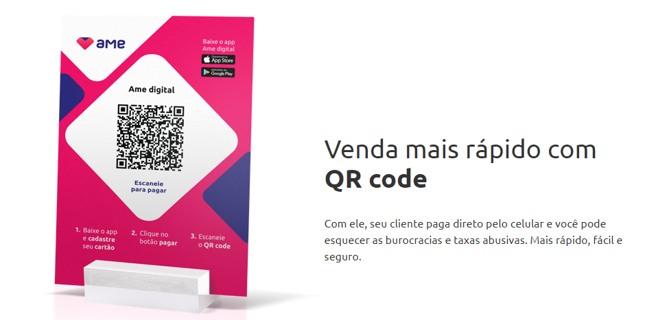

Análise do AME digital e a melhor opção de cashless para o RDM 2020
===

&nbsp;

 Índice
 --

*   [Overview Ame Digital](#overview)
    *   [O que é o Ame Digital?](#ame)
    *   [Como funciona?](#como-ame)
        *   [Para quem compra](#compra-ame)
        *   [Para quem vende](#venda-ame)
        *   [Tabela de custos e Prazos](#tabela)

*   [Sistemas Cashless](#sistema)

&nbsp;

&nbsp;
<h2 id="overview">Overview Ame Digital</h2>  
<h3 id="ame">O que é o Ame Digital?</h3>
&nbsp;

>Nascemos em 2018 para revolucionar a maneira como as pessoas se relacionam com o dinheiro – somos uma fintech e estamos criando uma plataforma de negócios mobile criada para ser essencial na vida das pessoas! Esse propósito nos guia todos os dias.  

Essencialmente a _Ame Digital_ é uma fintech criada pelo grupo americanas, que busca uma mudança na experiência de venda e consumo das pessoas. Com iniciativas de cashback  e facilidades de crédito para seus usuários.

&nbsp;
<h3 id="como-ame">Como funciona?</h3>
&nbsp;

A Ame é um aplicativo _Mobile_ então todas as suas operações são feitas pelo celular. Desde criação da sua conta de cliente a pagamentos. É muito simples criar uma conta com eles, em menos de 2 minutos você ja está pronto para começar a usar os serviços da Ame. (_Eu mesmo fiz o teste_)

&nbsp;
<h3 id="compra-ame">Para quem compra</h3>
&nbsp;

As principais facilidades para o usuário Ame são:
- Pagamentos, transferências, depósitos, recarga de celular.
- Vantagens exclusivas nas lojas parceiras.
  - Lojas Americanas, nos sites da Americanas.com, Shoptime, Submarino, Soubarato são algumas.
- Não cobra anuidade ou valores de manutenção, muito menos taxa de ativação da conta.
- Sistema de Cashback, o saldo entra automaticamente na sua conta Ame e não expira nunca.
  - O valor do cashback não é fixo, ele varia de acordo com as ações promocionais das lojas parceiras.

&nbsp;
<h3 id="venda-ame">Para quem vende</h3> 
&nbsp;

Principais facilidades para quem vende:

- Você consegue gerar 2 tipos de QR code: com e sem valor.
  - No QR code com valor, você já pré-determina o valor a ser pago pelo seu cliente.

  - Já com o QR code sem valor é mais genérico. Com ele, o cliente lê o código e digita o valor a te pagar. Muito útil para compras de mais de um item ou então para quem vende uma variedade grande de produtos.

- **Não tem taxa** de transferência. Porém você só pode realizar **dois saques por dia**.

&nbsp;
<h3 id="tabela">Tabela de custos e prazos</h3>
&nbsp;

|Tabela de custos e tarifas         |                       |      |
|-----------------------------------|:---------------------:|------|
|Mensalidade / Anuidade da conta Ame|        -----          |Grátis|
|Receber valores de outro usuário   |        -----          |Grátis|
|Enviar valores para outro usuário  |        -----          |Grátis|
|Comprar com Ame                    |        -----          |Grátis|
|Recarregar celular                 |        -----          |Grátis|
|Depositar	                        | Cartão de Crédito     |Grátis|
|Depositar	                        | Lojas Americanas	    |Grátis|
|Depositar	                        | Transferência Bancária|Grátis|

&nbsp;

&nbsp;

|Tabela de prazos e disponibilidade                                     |                     |
|-----------------------------------------------------------------------|---------------------|
| Saldo do Receba de Volta          | Em 30 (trinta) dias corridos após aprovação do pagamento|
| Transferência de valores (saldo) entre usuários (envio e recebimento) | Até 6 (seis) Horas |
| Aprovação do pagamento com conta Ame                                  | Até 72 (setenta e duas) horas  |
| Retorno Devido à Impossibilidade de Transferência                     | Automaticamente    |
| Carregar saldo / Transferência entre usuários via cartão de crédito   | Até 72 (setenta e duas) horas |

&nbsp;

*  *  *

&nbsp;
<h2 id="sistema">Sistemas Cashless</h2>
&nbsp;

>Antes de tudo, até o presente momento da pesquisa feita, NÃO FOI ENCONTRADO nenhum sistema que tenha integração com a Ame.

&nbsp;

Nós últimos 2 (dois) anos fizemos 3 (três) eventos usando o sistema cashless de consumo da 
[Nugo](https://www.nugo.com.br) , porém devido a mudanças internas até o presente momento (_13/08/2020_) não vamos conseguir utilizar o sistema esse ano no RDM 2021.

Dito isso foi feita uma pesquisa para buscar as melhores opções de sistema para usarmos. É importante salientar que as informações contidas aqui são limitadas, justamente porque sistemas de cashless no Brasil não tem uma "unificação" ou "padronização" no modo como eles disponibilizam as informações. Então o interessante seria conseguir se reunir com as melhores opções dessa lista pra tirar todas as duvidas e buscar possíveis parcerias.

_Projeto escrito e idealizado por Álex Luna_

=======